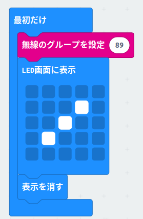

> このページを開く [https://ok-kun318.github.io/seat-side/](https://ok-kun318.github.io/seat-side/)

## ~~拡張機能として使用~~　できません

~~このリポジトリは、MakeCode で **拡張機能** として追加できます。~~

* ~~[https://makecode.microbit.org/](https://makecode.microbit.org/) を開く~~

* ~~**新しいプロジェクト** をクリックしてください~~

* ~~ギアボタンメニューの中にある **拡張機能** をクリックしてください~~

* ~~**https://github.com/ok-kun318/seat-side** を検索してインポートします。~~

## このプロジェクトを読み込みます

MakeCode でこのリポジトリを読み込みます。

* [https://makecode.microbit.org/](https://makecode.microbit.org/) を開く
* **読み込む** をクリックし、 **URLから読み込む...** をクリックしてください
* **https://github.com/ok-kun318/seat-side** を貼り付けてインポートをクリックしてください

# 使い方
> [!IMPORTANT]
> このレポジトリは　[hand-side](https://github.com/Ok-kun318/hand-side/)と併用します

### 1. install
* hexファイルを[ここから](https://github.com/Ok-kun318/hand-side/releases/download/v1.0.1/microbit-seat-side-v1.0.1.hex).ダウンロードします
* micro:bitに書き込む😸
> [!WARNING]
>この[プロジェクト](https://github.com/Ok-kun318/hand-side)も同じように書き込みをしてください

### 2. 使い方

それぞれハンドルとサドルに取り付けてください
> [!NOTE]
> ちなみに僕は輪ゴムでつけました

## ハンドル側

Aボタンを押したら左側の矢印が付きます

Bボタンを押したら右側の矢印が付きます

ロゴを押したらブレーキランプ(?)的なものが付きます

micro:bitを下向きにしたらコンパスが消えます
> [!IMPORTANT]
> ５秒後に下向きにしたらコンパスが付きます

## サドル側

Aボタンを押すことによってテールランプが付きます

Bボタンを押すと点滅、点灯を切り替えられます

ロゴを押すとつながっているハンドル側のコンパスの調整ができます

> [!WARNING]
> 混線した場合は回避するため
> 
> 
>
> の無線のグループを設定(89)のところを0~255の値にしてください
>
> この値はハンドル側のmicro:bitと同じにしてください

#### メタデータ (検索、レンダリングに使用)

* for PXT/microbit

